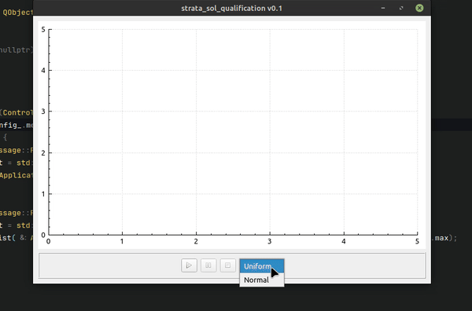

## Квалификационное задание в [Strata Solutions](https://www.stratasolutions.ru)

Исходный текст [задания](problem.pdf):
> Необходимо реализовать запуск, установку на паузу и остановку отдельного потока по нажатию соответствующих клавиш. Выполнять передачу массива случайно генерируемых значений (x;у) из потока и отображать их на графике. Управляющие клавиши:
> * старт - массив генерируемых значений начинает отображаться на графике, 
> * пауза - на графической сцене фиксируется набор сгенерированных значений, поток «приостанавливается», при повторном нажатии старт - продолжается генерация и отображение новых значений из потока 
> * стоп - очищает графическую сцену и заканчивает работу потока

Так как в задании не указан тип распределения, реализовано два (равномерное и нормальное), введен переключатель типа.  

Скринкаст:

